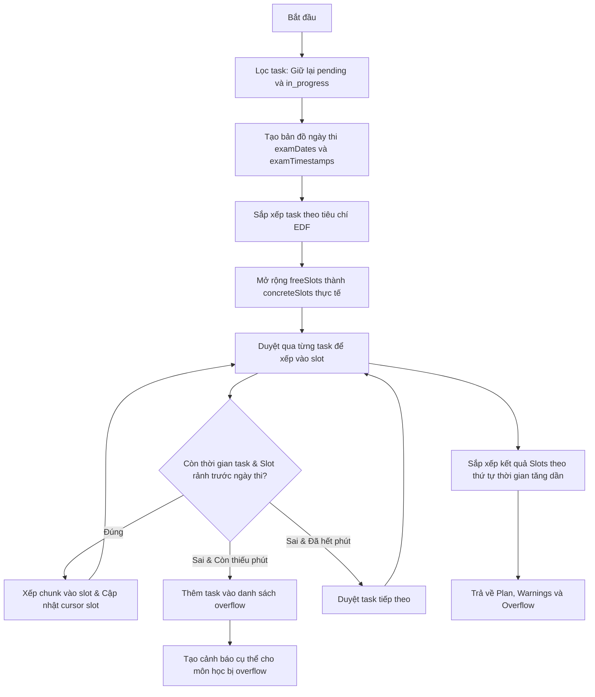

# Đặc tả Kỹ thuật: Thuật toán Lập lịch Học tập EDF với Chia nhỏ Task (EDF-based Greedy Scheduling with Task Splitting)

Tài liệu này đặc tả thuật toán lập lịch học tập thông minh dựa trên thời hạn thi cử gần nhất (EDF), giải quyết các bất cập về độ lệch múi giờ và đồng bộ dữ liệu trạng thái task.

---

## 1. Mục tiêu (Objective)
Xây dựng công cụ lập lịch học tập tự động cho sinh viên dựa trên:
*   Danh sách môn thi và thời gian thi tương ứng.
*   Đề cương chi tiết (syllabus) phân rã thành các task cần học với thời lượng dự kiến.
*   Khung thời gian rảnh hàng tuần (Free Slots).

### Các yêu cầu cốt lõi của Thuật toán mới:
1.  **Chính xác múi giờ**: Đảm bảo ngày tháng hiển thị trên giao diện và tính toán lưu trữ thống nhất theo múi giờ cục bộ của thiết bị người dùng (local timezone), khắc phục hoàn toàn lỗi lệch 1 ngày do dùng UTC ISO String ở các vùng GMT+7.
2.  **Nguyên lý EDF làm chủ đạo**: Sắp xếp thứ tự ưu tiên học theo thời gian thi gần nhất. Môn thi trước học trước.
3.  **Hỗ trợ chia nhỏ task (Task Splitting)**: Nếu một task ước lượng cần nhiều thời gian hơn slot rảnh hiện tại, task sẽ được chia nhỏ (chia thành nhiều chunk) để lấp đầy slot rảnh hiện tại và phần còn lại sẽ được đẩy sang các slot tiếp theo.
4.  **Phát hiện và cảnh báo quá hạn (Overflow)**: Nếu tổng thời gian rảnh trước ngày thi của môn học không đủ để hoàn thành các task, phần thời gian thiếu hụt phải được chỉ rõ theo từng môn và cảnh báo đến người dùng.
5.  **Duy trì task đang thực hiện**: Cả hai trạng thái task `"pending"` và `"in_progress"` đều phải được đưa vào danh sách lập lịch (chỉ loại bỏ các task đã hoàn thành `"completed"`).

---

## 2. Lệnh dự án (Commands)
Dự án được xây dựng bằng React, TypeScript và Vite. Các lệnh sử dụng:
*   `npm install` — Cài đặt các gói phụ thuộc.
*   `npm run dev` — Chạy ứng dụng ở môi trường phát triển local.
*   `npm run build` — Biên dịch ứng dụng sang production bundle (sử dụng để xác thực lỗi typescript/lint).
*   `npm run preview` — Chạy thử bản build production.

---

## 3. Cấu trúc Dự án (Project Structure)
Các file liên quan trực tiếp đến việc thay đổi thuật toán xếp lịch:
*   `src/types/index.ts` — Định nghĩa kiểu dữ liệu cho `StudyTask`, `FreeSlot`, `ScheduleSlot`, `StudyPlan`, `ScheduleWarning`.
*   [schedule.ts](file:///d:/Code/study-planner/src/utils/schedule.ts) — Các hàm tiện ích xử lý ngày tháng (`formatDate`, `getWeekStart`, `addDays`).
*   [scheduler.ts](file:///d:/Code/study-planner/src/utils/scheduler.ts) — Lõi thuật toán `generateSchedule` và thuật toán sắp xếp EDF.
*   [SchedulePage.tsx](file:///d:/Code/study-planner/src/pages/SchedulePage.tsx) — Page chứa giao diện lịch học và trigger gọi tạo lịch học.
*   [ScheduleView.tsx](file:///d:/Code/study-planner/src/components/ScheduleView/ScheduleView.tsx) — Component hiển thị lưới thời gian và cảnh báo thiếu thời gian học.

---

## 4. Đặc tả Chi tiết Thuật toán (Algorithm Specification)

### Đầu vào (Inputs):
*   `tasks: StudyTask[]` — Danh sách các nhiệm vụ học tập cần lên lịch.
*   `freeSlots: FreeSlot[]` — Khung giờ rảnh lặp lại hàng tuần (ví dụ: Thứ 2 từ 19:00 - 21:00).
*   `exams: ExamInfo[]` — Thông tin lịch thi của các môn học.

### Đầu ra (Outputs):
*   `plan: StudyPlan` — Chứa danh sách các ô lịch học `ScheduleSlot[]` đã được xếp.
*   `warnings: ScheduleWarning[]` — Danh sách các cảnh báo (bao gồm cảnh báo thiếu thời gian ôn tập).
*   `overflow: StudyTask[]` — Danh sách các task bị quá hạn (hoặc phần thời lượng còn thiếu của task không xếp được trước ngày thi).

### Các bước xử lý của thuật toán:

#### Tiêu chí sắp xếp EDF (EDF Sorting Criteria):
1.  **Hạn thi (Exam Date) tăng dần**: Môn nào thi trước, xếp lịch học trước.
2.  **Độ ưu tiên (Priority) giảm dần**: Nếu cùng ngày thi, task có mức độ ưu tiên cao hơn (`high` > `medium` > `low`) xếp trước.
3.  **Thời lượng ước lượng (Estimated Minutes) giảm dần**: Nếu cùng ngày thi và cùng độ ưu tiên, task nặng hơn xếp trước (để dễ tối ưu hóa không gian trống).
4.  **Tên nhiệm vụ tăng dần (Lexicographical Name ASC)**: Đảm bảo thuật toán chạy ra kết quả nhất quán (deterministic).

#### Quy tắc chặn Ngày thi:
*   Mọi slot học của task thuộc môn X phải nằm **trước ngày thi** của môn X (so sánh `block.date < examDate.slice(0, 10)`).

---

## 5. Chiến lược Kiểm thử (Testing Strategy)

Do dự án hiện tại là frontend client-side, việc kiểm thử sẽ dựa trên:
1.  **Manual Verification**:
    *   **Múi giờ**: Kiểm tra trên trình duyệt ở múi giờ GMT+7, bảo đảm ngày Thứ 2, Thứ 3 trùng với ngày thực tế. Highlight đúng cột ngày hôm nay.
    *   **Thứ tự EDF**: Đăng ký 2 môn thi có ngày thi cách nhau. Đảm bảo task của môn thi sớm hơn luôn chiếm các slot học đầu tiên.
    *   **Chia nhỏ task**: Đăng ký 1 task có thời lượng 120 phút. Đăng ký khung giờ rảnh 2 ngày liên tiếp, mỗi ngày 60 phút. Đảm bảo thuật toán chia task đó thành 2 phần xếp đều vào 2 ngày.
    *   **Cảnh báo Overflow**: Đăng ký các task học có tổng thời lượng lớn hơn tổng thời gian rảnh khả dụng trước ngày thi. Kiểm tra xem giao diện có xuất hiện cảnh báo ghi rõ tên môn học bị thiếu thời gian ôn tập hay không.
2.  **Unit/Integration Test (Scratch script)**:
    *   Sử dụng một tập lệnh Node.js/TypeScript tạm thời chạy trong môi trường node để kiểm tra đầu ra của hàm `generateSchedule` đối với các bộ dữ liệu mô phỏng.

---

## 6. Ranh giới & Quy tắc (Boundaries & Constraints)
*   **Không tự ý thay đổi dữ liệu thủ công**: Lịch tự động chỉ tạo lại khi người dùng nhấn nút "Tạo lại lịch" hoặc bật lại chế độ "Tự động". Không tự động reset lịch khi người dùng đang ở chế độ chỉnh sửa thủ công (`plan.manualEdited === true`).
*   **Không dùng múi giờ UTC để hiển thị**: Tuyệt đối không dùng `.toISOString()` để lưu trữ trực tiếp ngày của slots mà không qua định dạng múi giờ cục bộ.
